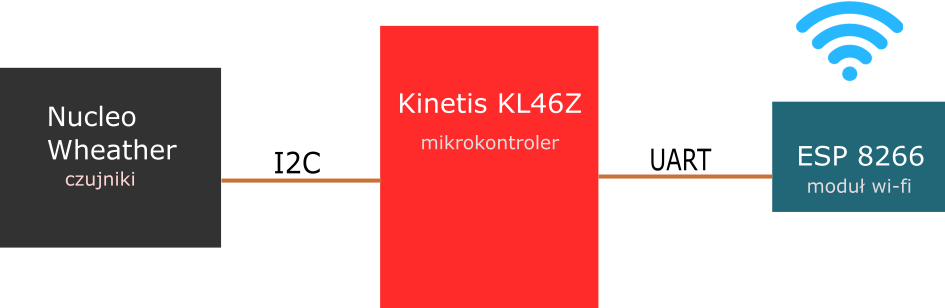

# Stacja-pogodowa

<b>I. Tytuł: Stacja pogodowa</b>  
  
<b>II. Autorzy: </b>  
  
<b>III. Założenia projektowe:</b>  
1.	Odczyt danych z Nucleo Weather przez I2C po przyciśnięciu przycisku na stronie internetowej, w sposób ciągły co 10 sekund lub jednorazowo. Gdy przestaniemy pobierać dane, układ przejdzie w tryb uśpienia.  
2.	Zapis pomiarów w mikrokontrolerze.  
3.	Przesłanie danych przez UART do modułu ESP z wifi.  
4.	Pobranie danych przy użyciu wi-fi przez urządzenie zewnętrzne.  
5.	Prezentacja pomiarów na stronie internetowej (HTML).  
  
<b>IV.</b>  
 a) Wykorzystane protokoły:  
•	UART,  
•	I2C.  
  
b) Wykorzystane układy:  
•	płytka Kinetis FRDM-KL46Z,  
•	KA Nucleo Weather (stacja pogodowa),  
•	moduł ESP2866.  
  
c)  Wykorzystane peryferia:  
•	timery,  
•	tryb uśpienia.  
  
<b>V. Schemat blokowy:</b>  

  
<b>VI. Kamienie milowe:</b>  
1. Połączenie mikrokontrolera z zestawem czujników. (18-24 grudnia)  
2. Połączenie mikrokontrolera z modułem esp8266. (8-14 stycznia)  
3. Strona internetowa, zakończenie projektu. (22-26 stycznia)  

  
